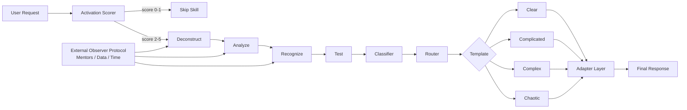

# systems-thinking-dart-skill

[](LICENSE)
[](CHANGELOG.md)
[](systems-thinking-dart/adapters/)

## TL;DR

`systems-thinking-dart` is a portable agent skill for classifying problems before answering.
It is for AI agents, prompt engineers, and teams that need better decisions under ambiguity.
It matters because not every request deserves the same depth, speed, or reasoning mode.

## The problem

Most AI agents default to treating every non-trivial request as "complicated". The same reasoning depth gets applied to a translation, a production incident, a product bet, and an irreversible architecture decision.

That creates two failure modes: overthinking simple work and under-structuring messy systems. The result is slower execution, shallow strategy, missed incentives, and avoidable second-order effects.

## The solution

This repo packages DART plus an adapted Cynefin classification as a meta-reasoning layer:

- **Deconstruct:** split the request into facts, assumptions, constraints, stakes, and reversibility.
- **Analyze:** classify cause and effect as Clear, Complicated, Complex, or Chaotic.
- **Recognize:** detect known patterns, including Cobra Effect incentives and delayed feedback loops.
- **Test:** choose the smallest useful experiment, or stabilize first in chaos.

Cynefin, developed by Dave Snowden, and D.A.R.T, developed by Sandeep Swadia, are combined here as a meta-reasoning layer for matching action to context. Two short anchors from the original Cynefin framing are useful here: "probe-sense-respond" for complex domains and "act-sense-respond" for chaotic domains.

## Quickstart

### Claude Projects

```bash
git clone https://github.com/LeonardoGonzalez/systems-thinking-dart-skill.git
```

Upload `systems-thinking-dart/SKILL.md`, `activation-criteria.md`, `response-templates/`, and `adapters/claude.md` to a Claude Project.

### Cursor

```bash
git clone https://github.com/LeonardoGonzalez/systems-thinking-dart-skill.git
mkdir -p .cursor/rules
cp systems-thinking-dart/SKILL.md .cursor/rules/systems-thinking-dart.mdc
```

Then paste the relevant adapter from `systems-thinking-dart/adapters/` into the same rule or attach it as project context.

### Continue

```bash
git clone https://github.com/LeonardoGonzalez/systems-thinking-dart-skill.git
```

Add `systems-thinking-dart/SKILL.md` as a custom context file and include the adapter matching your model.

### Aider

```bash
git clone https://github.com/LeonardoGonzalez/systems-thinking-dart-skill.git
aider --read systems-thinking-dart/SKILL.md --read systems-thinking-dart/adapters/gpt.md
```

### OpenAI Custom GPT

```bash
git clone https://github.com/LeonardoGonzalez/systems-thinking-dart-skill.git
```

Paste `systems-thinking-dart/SKILL.md` into Instructions and upload the rest of `systems-thinking-dart/` as knowledge.

### Generic CLI

```bash
git clone https://github.com/LeonardoGonzalez/systems-thinking-dart-skill.git
```

Add this instruction to your agent:

```text
When a task is ambiguous, costly, irreversible, multi-causal, time-pressured, or stakeholder-heavy, load systems-thinking-dart/SKILL.md and follow its router.
```

## How it works



## Supported agents

| Agent or model family | Adapter | Status |
| --- | --- | --- |
| Claude Sonnet / Opus / Haiku | `systems-thinking-dart/adapters/claude.md` | 🧪 experimental |
| GPT-4o / GPT-5 | `systems-thinking-dart/adapters/gpt.md` | 🧪 experimental |
| DeepSeek V3 / V4 | `systems-thinking-dart/adapters/deepseek.md` | 🧪 experimental |
| Gemini 2.x | `systems-thinking-dart/adapters/gemini.md` | 🧪 experimental |
| Local models under 8B | `systems-thinking-dart/adapters/local-small.md` | 🧪 experimental |
| o1 / R1 / thinking-native models | `systems-thinking-dart/adapters/reasoning-models.md` | 🧪 experimental |
| New community models | `adapters/_template.md` | ❓ untested |

## Examples

### Clear

Input: "Convert this list into a checklist."

Classification: Clear.

Response type: executable checklist with no strategy overhead.

### Complex

Input: "Our referral bonus doubled leads but closed deals fell. What should we do?"

Classification: Complex.

Response type: minimum viable experiment, quality metrics, Cobra Effect check, and stop rule.

### Chaotic

Input: "A production secret was leaked publicly 20 minutes ago."

Classification: Chaotic.

Response type: immediate stabilization, containment, minimum signal, then reclassification.

## Why this is not redundant with reasoning models

Reasoning models can think deeply, but depth alone does not decide how much reasoning is appropriate. A strong model can still overthink a clear task, treat a complex incentive system as an expert-analysis problem, or miss the need to stabilize before diagnosing.

`systems-thinking-dart` adds an explicit control layer:

- Classification before answer.
- Anti-Cobra and delayed-loop checks.
- A self-deactivation rule for low-impact Clear tasks.
- A router that changes the answer shape, not just the amount of reasoning.

For o1, R1, and Sonnet-thinking style models, DART works as a checksum over the final response rather than a replacement for native reasoning.

## Roadmap

- Add tested adapter scorecards for major hosted models.
- Add a local eval runner with provider plugins.
- Add examples for product, incident response, policy, architecture, and hiring decisions.
- Add more trap cases for self-deactivation.
- Publish adapter quality badges after community evals.

## Contributing

See [CONTRIBUTING.md](CONTRIBUTING.md) and [docs/contributing-adapters.md](docs/contributing-adapters.md).

## License

MIT. See [LICENSE](LICENSE).

## Credits

Based on Dave Snowden's Cynefin framework and Sandeep Swadia's D.A.R.T framework for agent routing: Deconstruct, Analyze, Recognize, Test.
