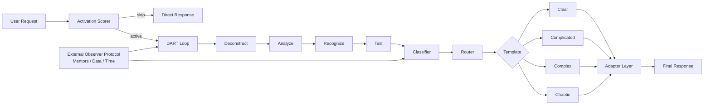

# Architecture

`systems-thinking-dart` is a routing layer for agent responses. It does not replace model reasoning; it decides which kind of reasoning and response shape the agent should use.

Cynefin is introduced here as a lightweight classification model: Clear problems have obvious procedures, Complicated problems need expert analysis, Complex problems require probes, and Chaotic problems require immediate stabilization.

## Flow

## Components

### Activation Scorer

Decides whether the skill should run. It prevents overhead on trivial, reversible, low-impact tasks.

### DART Loop

Runs the core method:

- Deconstruct the situation.
- Analyze cause and effect.
- Recognize patterns and anti-patterns.
- Test with a small experiment, unless the system is Chaotic.

### Classifier

Assigns one of four systems:

- Clear.
- Complicated.
- Complex.
- Chaotic.

### Router

Loads exactly one response template from `systems-thinking-dart/response-templates/`.

### Adapter Layer

Adjusts reasoning depth, output shape, tool use, context handling, and sampling for a specific model family.

### External Observer Protocol

Uses Mentors, Data, and Time when classification is low confidence, stakes are high, incentives matter, or narrative is replacing evidence.
